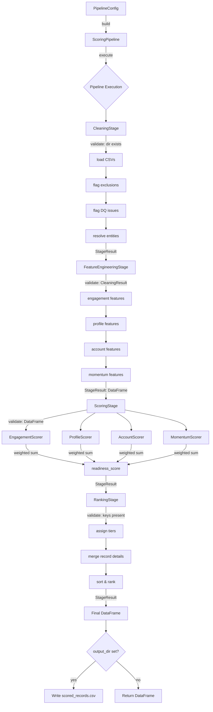
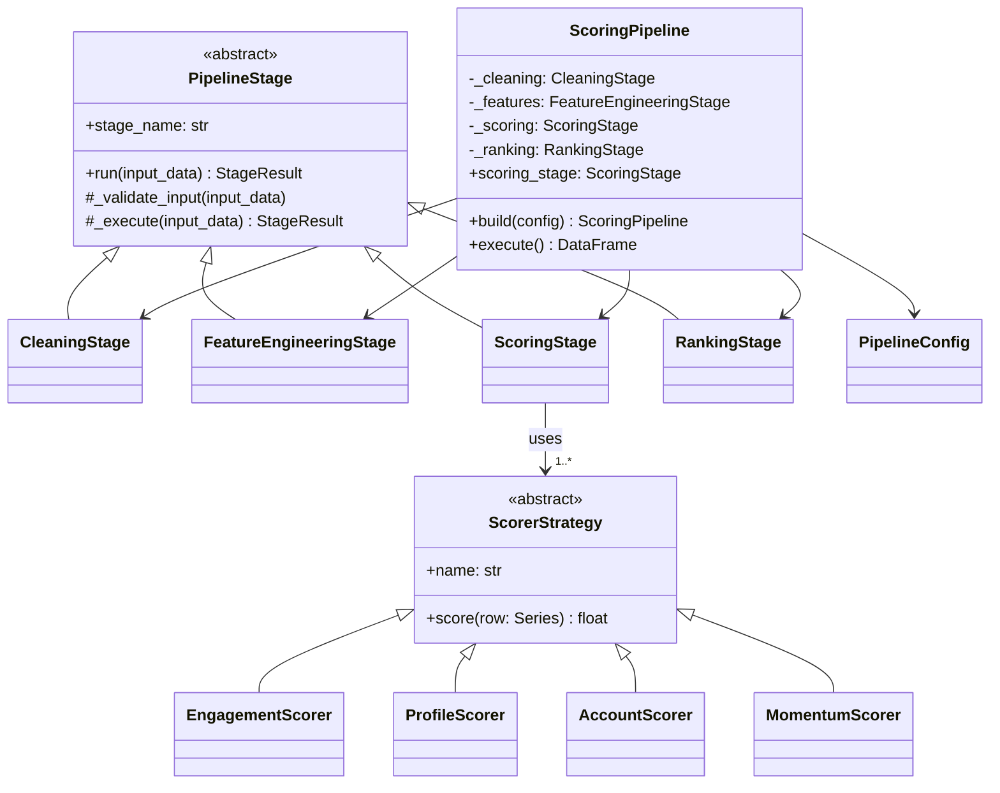

# Pipeline Architecture

## Overview

The `src/pipeline/` package implements a **4-layer lead/contact readiness scoring pipeline** using object-oriented design patterns. It transforms raw CRM data into a ranked, tiered list of sales-ready records.

```
src/pipeline/
├── __init__.py          # Public API exports
├── base.py              # Abstract base classes (PipelineStage, StageResult)
├── scorers.py           # Strategy pattern: pluggable scoring algorithms
├── pipeline.py          # Orchestrator, concrete stages, config, factory
├── run_pipeline.py      # Backward-compatible entry point
├── logging_config.py    # Shared logger infrastructure
└── stages/              # Core transformation logic (procedural layer)
    ├── __init__.py
    ├── clean.py         # Layer 1: Data cleaning & entity resolution
    ├── features.py      # Layer 2: Feature engineering
    ├── score.py         # Layer 3: Component scoring (legacy procedural)
    └── rank.py          # Layer 4: Ranking & tiering
```

---

## OOP Design Patterns Used

### 1. Template Method Pattern (`base.py`)

The `PipelineStage` abstract base class defines a fixed algorithm skeleton (`run`), deferring specific steps to subclasses.

```python
class PipelineStage(ABC):
    def run(self, input_data) -> StageResult:        # Template method (fixed)
        self._validate_input(input_data)             # Step 1: Override
        result = self._execute(input_data)           # Step 2: Override
        return result

    @abstractmethod
    def _validate_input(self, input_data) -> None: ...
    @abstractmethod
    def _execute(self, input_data) -> StageResult: ...
```

**Concrete stages:** `CleaningStage`, `FeatureEngineeringStage`, `ScoringStage`, `RankingStage`

---

### 2. Strategy Pattern (`scorers.py`)

Each scoring dimension is an interchangeable algorithm behind the `ScorerStrategy` interface. New scoring logic can be added without modifying existing code.

```python
class ScorerStrategy(ABC):
    @property
    @abstractmethod
    def name(self) -> str: ...

    @abstractmethod
    def score(self, row: pd.Series) -> float: ...
```

**Concrete strategies:** `EngagementScorer`, `ProfileScorer`, `AccountScorer`, `MomentumScorer`

**Runtime swap:**
```python
pipeline.scoring_stage.replace_scorer("score_engagement", CustomEngagementScorer())
```

---

### 3. Factory Method Pattern (`pipeline.py`)

`ScoringPipeline.build(config)` constructs a fully wired pipeline from a single configuration object. Callers don't need to know internal wiring details.

```python
config = PipelineConfig(data_dir="./data/raw", output_dir="./data/processed")
pipeline = ScoringPipeline.build(config)
result = pipeline.execute()
```

---

### 4. Composite / Pipeline Pattern (`pipeline.py`)

`ScoringPipeline` composes four stage objects into a sequential pipeline. Stages are independent objects that can be individually tested, replaced, or reordered.

---

### 5. Data Transfer Objects (`StageResult`, `PipelineConfig`)

Dataclasses provide structured communication between stages with typed fields and validation.

---

## Benefits

| Benefit | How It's Achieved |
|---------|-------------------|
| **Open/Closed Principle** | Add new scorers by implementing `ScorerStrategy` — no modification to existing code |
| **Single Responsibility** | Each stage class owns exactly one transformation step |
| **Testability** | Each stage and scorer can be unit-tested in isolation |
| **Runtime Configurability** | Swap scoring algorithms, adjust weights, change tier thresholds without code changes |
| **Encapsulation** | Internal state (config, data_dir) is private; interaction happens through well-defined interfaces |
| **Separation of Concerns** | Infrastructure (logging, validation) lives in the base class; business logic in subclasses |
| **Backward Compatibility** | Old procedural `run_pipeline()` function still works — delegates to OOP layer internally |

---

## Execution Flow



---

## Class Hierarchy



---

## Usage Examples

### Basic (backward-compatible)

```python
from src.pipeline import run_pipeline

df = run_pipeline(data_dir="./data/raw", output_dir="./data/processed")
```

### OOP with custom configuration

```python
from src.pipeline import ScoringPipeline, PipelineConfig, ScoringWeights

config = PipelineConfig(
    data_dir="./data/raw",
    output_dir="./data/processed",
    weights=ScoringWeights(engagement=0.50, profile=0.20, account=0.20, momentum=0.10),
)
pipeline = ScoringPipeline.build(config)
df = pipeline.execute()
```

### Swapping a scorer at runtime

```python
from src.pipeline import ScoringPipeline, PipelineConfig, EngagementScorer, EngagementScoringConfig

config = PipelineConfig(data_dir="./data/raw")
pipeline = ScoringPipeline.build(config)

# Use aggressive decay (30-day half-life instead of 45)
aggressive = EngagementScorer(EngagementScoringConfig(half_life_days=30.0))
pipeline.scoring_stage.replace_scorer("score_engagement", aggressive)

df = pipeline.execute()
```

### Creating a custom scorer

```python
from src.pipeline.scorers import ScorerStrategy
import numpy as np
import pandas as pd

class TechStackScorer(ScorerStrategy):
    @property
    def name(self) -> str:
        return "score_tech_stack"

    def score(self, row: pd.Series) -> float:
        # Custom logic for tech-stack affinity
        return float(np.clip(row.get("tech_match", 0) * 100, 0, 100))

# Plug it in
pipeline.scoring_stage.add_scorer(TechStackScorer())
```
