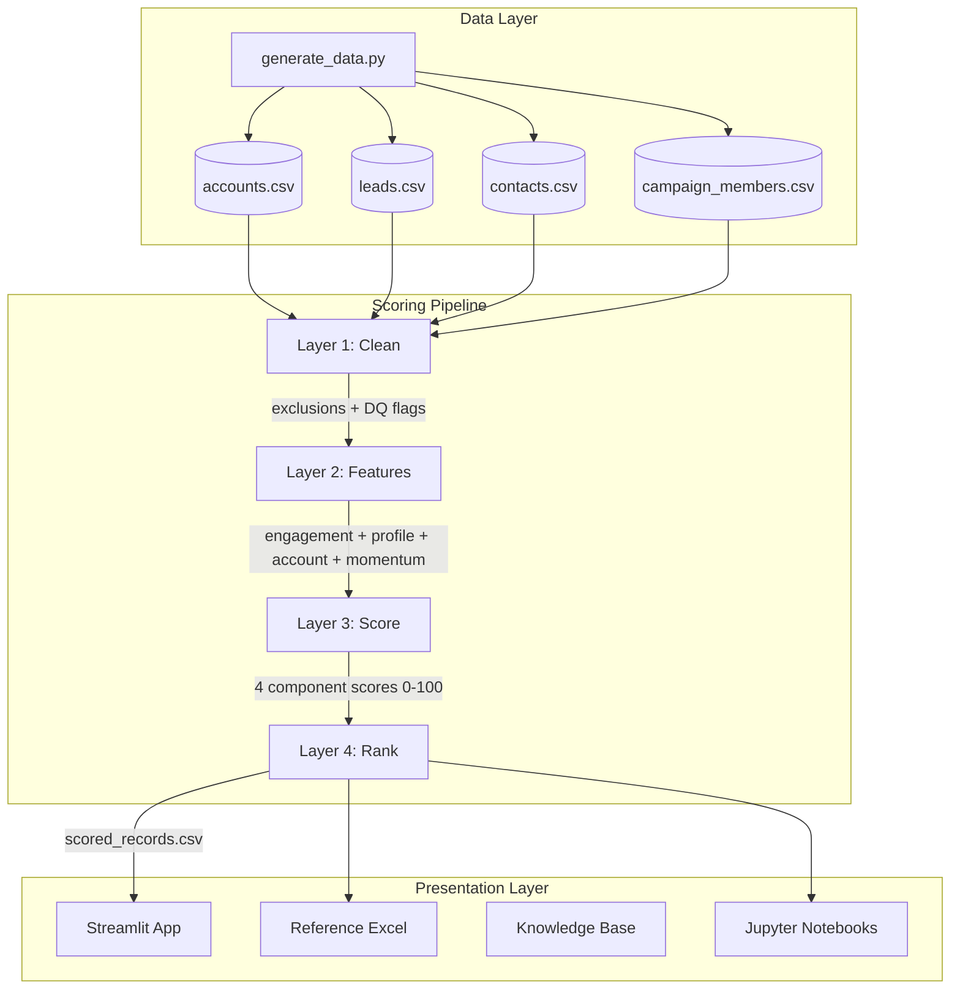
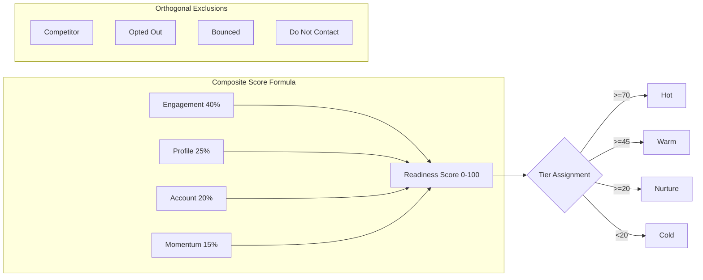

# Lead/Contact Readiness Scoring POC

[](https://colab.research.google.com/github/akhilesh-yadav/lead-scoring/blob/main/notebooks/01_data_exploration.ipynb)
[](https://lead-scoring-poc.streamlit.app/)

A prioritization scoring system for B2B cybersecurity BDR teams. Replaces the legacy MQL flag with a multi-dimensional, time-aware, explainable **0-100 readiness score** to answer one question:

> "Give me a ranked list of the top 500 people to call this week. Show me why."

---

## Table of Contents

- [Quick Start](#quick-start)
- [Architecture Overview](#architecture-overview)
- [Project Structure](#project-structure)
- [Pipeline Deep Dive](#pipeline-deep-dive)
- [Scoring Model](#scoring-model)
- [Data Quality Framework](#data-quality-framework)
- [Synthetic Data Generation](#synthetic-data-generation)
- [Demo Application](#demo-application)
- [Testing](#testing)
- [Configuration & Tuning](#configuration--tuning)
- [Deployment](#deployment)
- [Skills Reference](#skills-reference)
- [Developer Guide](#developer-guide)
- [Design Decisions & Tradeoffs](#design-decisions--tradeoffs)

---

## Quick Start

```bash
# Option A: Makefile (recommended)
make setup      # Install dependencies
make data       # Generate synthetic CRM data (1000 records)
make score      # Run scoring pipeline
make app        # Launch demo at localhost:8501
make test       # Run all 73 tests

# Option B: CLI
python -m lead_scorer generate         # Generate data
python -m lead_scorer score            # Run pipeline
python -m lead_scorer demo             # Launch app
python -m lead_scorer validate         # Run tests

# Option C: Direct scripts
pip install ".[dev]"
python scripts/generate_data.py
python src/pipeline/run_pipeline.py
streamlit run src/app/main.py
```

---

## Architecture Overview





---

## Project Structure

```
lead-scoring-poc/
├── scripts/                         # Utility scripts
│   ├── generate_data.py             # CRM data synthesis (1000 records, 10 DQ issues)
│   └── generate_scoring_reference.py  # Excel reference sheet generator
├── data/                            # Data layer
│   ├── raw/                         # Generated synthetic CSVs (reproducible)
│   │   ├── accounts.csv             # 200 accounts
│   │   ├── leads.csv                # 600 leads
│   │   ├── contacts.csv             # 400 contacts
│   │   └── campaign_members.csv     # 4000 engagement records
│   └── processed/                   # Pipeline outputs
│       ├── scored_records.csv        # Final scored & ranked output
│       └── scoring_model_reference.xlsx  # Heuristic logic reference
├── docs/                            # Documentation
│   ├── adr/                         # Architecture Decision Records
│   │   ├── 001-scoring-approach.md
│   │   ├── 002-time-decay-function.md
│   │   ├── 003-exclusion-model.md
│   │   └── 004-entity-fairness.md
│   └── knowledge-base/              # Analyst's notebook (core deliverable)
│       ├── 01-discovery-notes.md    # What we found in the data
│       ├── 02-design-decisions.md   # Why we built it this way
│       └── 03-lessons-learned.md    # Dead ends and tradeoffs
├── notebooks/                       # Jupyter exploratory notebooks
│   ├── 01_data_exploration.ipynb    # EDA and DQ profiling
│   └── 02_pipeline_walkthrough.ipynb  # Step-by-step pipeline demo
├── reports/                         # Generated reports and visualizations
│   └── figures/                     # Charts, plots for stakeholder review
├── src/                             # Source code (operational core)
│   ├── pipeline/                    # 4-layer scoring pipeline (OOP architecture)
│   │   ├── __init__.py              # Public API exports
│   │   ├── base.py                  # Abstract base: PipelineStage, StageResult
│   │   ├── scorers.py              # Strategy pattern: pluggable scorer algorithms
│   │   ├── pipeline.py             # Orchestrator class, concrete stages, factory
│   │   ├── run_pipeline.py          # Backward-compatible entry point
│   │   ├── logging_config.py        # Structured logging configuration
│   │   ├── ARCHITECTURE.md          # OOP design patterns documentation
│   │   └── stages/                  # Core transformation logic
│   │       ├── __init__.py          # Stage re-exports
│   │       ├── clean.py             # Layer 1: Cleaning & entity resolution
│   │       ├── features.py          # Layer 2: Feature engineering
│   │       ├── score.py             # Layer 3: Component scoring
│   │       └── rank.py              # Layer 4: Ranking & tiering
│   ├── app/                         # Streamlit demo application (8 pages)
│   │   └── main.py
│   └── cli/                         # CLI entry point (lead-scorer command)
│       ├── __init__.py
│       └── __main__.py
├── tests/                           # Unit + integration tests (73 passing)
│   ├── conftest.py                  # Shared fixtures
│   ├── test_clean.py                # Layer 1 tests
│   ├── test_features.py             # Layer 2 tests
│   ├── test_score.py                # Layer 3 tests
│   ├── test_rank.py                 # Layer 4 tests
│   └── test_integration.py          # Full pipeline end-to-end tests
├── skills/                          # Reusable skill definitions
├── lead_scorer/                     # Package entry for `python -m lead_scorer`
├── config.py                        # Environment-based configuration (dataclasses)
├── pyproject.toml                   # PEP 621 packaging & tool config
├── Makefile                         # One-command workflows (make data/score/test/app)
├── .github/workflows/ci.yml         # GitHub Actions CI pipeline
├── .pre-commit-config.yaml          # Automated linting on commit
├── Dockerfile                       # Container build for deployment
├── CONTRIBUTING.md                  # Extension guide for developers
└── README.md
```

---

## Pipeline Deep Dive

### Layer 1: Cleaning (`src/pipeline/stages/clean.py`)

**Purpose**: Flag exclusions, detect DQ issues, attempt entity resolution.

**Key functions**:
| Function | Input | Output |
|----------|-------|--------|
| `flag_lead_exclusions(leads)` | Raw leads DF | Leads with `exclude_*` columns |
| `flag_contact_exclusions(contacts, dnc_accounts)` | Raw contacts + DNC set | Contacts with `exclude_*` columns |
| `find_duplicate_emails(leads, contacts)` | Both DFs | Set of duplicate email addresses |
| `detect_etl_dates(dates, threshold)` | Date series | Set of ETL bulk-load dates |
| `flag_lead_dq(leads, dup_emails, etl_dates)` | Leads + detection results | Leads with `dq_*` columns |
| `resolve_broken_conversions(leads, contacts)` | Both DFs | Leads with `resolved_contact_id` |
| `clean_data(output_dir)` | Directory path | `CleaningResult` dataclass |

**Output**: `CleaningResult` containing cleaned DataFrames + resolution stats.

### Layer 2: Feature Engineering (`src/pipeline/stages/features.py`)

**Purpose**: Transform raw CRM fields into scoring-ready numeric features.

**Key functions** (all independently testable with minimal inputs):
| Function | Returns | Dependencies |
|----------|---------|-------------|
| `compute_engagement_features(id, type, cm, ref_date)` | `EngagementFeatures` dataclass | Campaign members table |
| `compute_profile_features(level, persona, title)` | `ProfileFeatures` dataclass | None (pure function) |
| `compute_account_features(account_id, accounts_df)` | `AccountFeatures` dataclass | Accounts table |
| `compute_momentum_features(id, type, cm, ref_date)` | `MomentumFeatures` dataclass | Campaign members table |

**All dataclasses** implement `.to_dict()` for easy DataFrame construction.

### Layer 3: Component Scoring (`src/pipeline/stages/score.py`)

**Purpose**: Apply scoring formulas to features. Each component yields 0-100.

**Scoring functions** (row → float):
- `score_engagement(row, config)` — Time-decay + volume + diversity - automation penalty
- `score_profile(row)` — Level × 50 + Persona × 50 + completeness bonus
- `score_account(row, lead_baseline)` — Named + ICP + intent + size (or baseline for leads)
- `score_momentum(row)` — Acceleration detection with bonus

**Configurable via**:
- `ScoringWeights(engagement, profile, account, momentum)` — must sum to 1.0
- `EngagementScoringConfig(half_life_days, volume_weight_30d, ...)` — tunable decay

### Layer 4: Ranking (`src/pipeline/stages/rank.py`)

**Purpose**: Assign tiers, merge record details, sort by score.

**Configurable via**:
- `TierConfig(hot_threshold, warm_threshold, nurture_threshold)`

---

## Scoring Model

### Composite Formula

```
readiness_score = (
    score_engagement × 0.40 +
    score_profile    × 0.25 +
    score_account    × 0.20 +
    score_momentum   × 0.15
)
```

### Time-Decay Function

```
recency = 100 × e^(-0.693 × days_since_last_engagement / 45)
```

| Days Since | Score |
|-----------|-------|
| 0 (today) | 100 |
| 15 | 79 |
| 30 | 63 |
| 45 | 50 |
| 90 | 25 |
| 180 | 6 |

### Tier Definitions

| Tier | Score Range | BDR Action |
|------|-------------|------------|
| 🔥 Hot | 70-100 | Call this week |
| 🌡️ Warm | 45-69 | Prioritize outreach |
| 🌱 Nurture | 20-44 | Marketing nurture |
| ❄️ Cold | 0-19 | Deprioritize |

### Key Design Constraints

1. **No circular dependency** — MQL status is never an input
2. **Recency dominates** — fresh engagement > historical depth
3. **Orthogonal exclusions** — exclusions are flags, not score penalties
4. **Entity-type fairness** — leads get 15pt account baseline
5. **Automation discounting** — only `is_responded=True` counts

---

## Data Quality Framework

> **Full catalogue**: [`docs/dq-issue-catalogue.md`](docs/dq-issue-catalogue.md) — detailed per-issue documentation showing how each failure manifests in raw data and exactly how the pipeline handles it.

### 10 DQ Categories Detected

| ID | Issue | Detection | Handling |
|----|-------|-----------|----------|
| DQ-1 | Broken conversion links | `is_converted=True` + NULL `converted_contact_id` | Attempt email-based resolution |
| DQ-2 | Email duplication | Cross-entity frequency analysis | Flag for review |
| DQ-3 | MQL date overwrites | MQL date on Recycled/Disqualified | Use campaign dates instead |
| DQ-4 | ETL timestamps | Date frequency clustering | Flag; don't use for cohort analysis |
| DQ-5 | Score field asymmetry | Different field names/scales per entity | Normalize separately |
| DQ-6 | Non-prospect contamination | Persona + company matching | Exclusion flag |
| DQ-7 | Completeness gaps | NULL rate analysis | Don't penalize; flag |
| DQ-8 | Automation inflation | Email + "Sent" status filtering | Filter before scoring |
| DQ-9 | Do-not-contact | Opted-out, bounced, DNC flags | Hard exclusion |
| DQ-10 | DQ/re-MQL cycling | Status transition patterns | Track as signal |

### Philosophy

- DQ issues are **overlay flags**, not score deductions
- A record can be high-scoring AND have DQ issues (they're independent concerns)
- Exclusions are **structural** — a competitor attending our webinars scores well; that's correct. They just shouldn't be in the callable pool.

---

## Synthetic Data Generation

### Object Model (Standard Salesforce)

```
Account (1:N) ←── Contact
Lead ──── converts to ──→ Contact (+ Account)
Campaign (1:N) ←── CampaignMember ──→ (Lead | Contact)
```

### Population Characteristics

| Object | Count | Key Properties |
|--------|-------|---------------|
| Accounts | 200 | 15% named, 25% ICP, 3% DNC |
| Leads | 600 | 35% converted, 13% non-prospect, 80% ETL timestamps |
| Contacts | 400 | 40% have lead origin, 8% no-longer-with-company |
| Campaign Members | 4000 | Zipf-distributed, 60% of emails are auto-sends |

### Reproducibility

All random seeds fixed (`seed=42`). Re-running produces identical output.

### Stress-Test Personas (10 archetypes injected)

Covers: hot prospect, stale profile, high-volume junior, zero-engagement executive, competitor, structural blocks, broken links, automation-inflated, cycling MQL, and thin-history-high-signal.

---

## Demo Application

**Framework**: Streamlit | **Port**: 8501 | **Pages**: 8

| Page | Purpose |
|------|---------|
| 🎬 The Story | 2-min guided narrative: why MQL is broken, how readiness scoring fixes it |
| 🧪 Persona Tester | Dropdown to verify all 10 Appendix B edge-case archetypes |
| 🎚️ Weight Explorer | Interactive sliders to re-score live — proves the pipeline is fully parameterized |
| 📊 Ranked List | Filterable table with progress bars, DQ/exclusion badge overlays |
| 🔍 Record Inspector | Drill-down: profile, score breakdown chart, engagement history, DQ flags |
| 📈 Score Distribution | Histograms, scatter plots, tier stats, entity-type fairness |
| 📚 Methodology | Full scoring model explainer (non-technical audience) |
| 📖 Knowledge Base | Discovery notes, design decisions, lessons learned |

### Navigating the Knowledge Base

The **Knowledge Base** tab in the app exposes the analyst's notebook directly:
- **Discovery Notes** — raw observations during data exploration, domain patterns found
- **Design Decisions** — trade-offs evaluated and why specific approaches were chosen
- **Lessons Learned** — what worked, what didn't, and what to do differently

These are also available as markdown files in `knowledge-base/` for reading outside the app.

---

## Testing

```bash
# Run all tests (73 tests)
python -m pytest tests/ -v

# Run specific layer
python -m pytest tests/test_clean.py -v         # 17 tests
python -m pytest tests/test_features.py -v      # 18 tests
python -m pytest tests/test_score.py -v         # 22 tests
python -m pytest tests/test_rank.py -v          # 8 tests
python -m pytest tests/test_integration.py -v   # 8 tests (full pipeline end-to-end)
```

### Test Design Principles

- **Each function is independently testable** with minimal fixtures
- **No global state** — functions accept and return data, never mutate inputs
- **Boundary conditions** — scores are always 0-100, weights always sum to 1.0
- **Dataclass outputs** — typed return values enable IDE support and assertions
- **Fixture isolation** — each test class has dedicated minimal fixtures

---

## Configuration & Tuning

### Scoring Weights

```python
from src.pipeline import ScoringWeights

# Engagement-heavy (default: "who to call NOW")
ScoringWeights(engagement=0.40, profile=0.25, account=0.20, momentum=0.15)

# Profile-heavy (for ICP-focused campaigns)
ScoringWeights(engagement=0.25, profile=0.45, account=0.20, momentum=0.10)

# Account-heavy (for ABM plays)
ScoringWeights(engagement=0.30, profile=0.15, account=0.40, momentum=0.15)
```

### Decay Parameters

```python
from src.pipeline import EngagementScoringConfig

# Faster decay (urgent campaigns, 2-week half-life)
EngagementScoringConfig(half_life_days=14)

# Slower decay (long-cycle enterprise, 90-day half-life)
EngagementScoringConfig(half_life_days=90)
```

### Tier Thresholds

```python
from src.pipeline.stages.rank import TierConfig

# Stricter (fewer Hot records, higher bar)
TierConfig(hot_threshold=80, warm_threshold=55, nurture_threshold=25)

# Looser (more records in callable pool)
TierConfig(hot_threshold=60, warm_threshold=35, nurture_threshold=15)
```

---

## Live Demo

> **🔗 Live URL:** [https://lead-scoring-poc.onrender.com](https://lead-scoring-poc.onrender.com)
>
> *(Deploy your own with `make docker` or see [Deployment](#deployment) below)*

---

## Deployment

### Docker (any cloud)

```bash
docker build -t lead-scoring-poc .
docker run -p 8501:8501 lead-scoring-poc
```

### Google Cloud Run

```bash
gcloud run deploy lead-scoring-poc \
  --source . \
  --region us-central1 \
  --allow-unauthenticated \
  --port 8501 \
  --memory 1Gi
```

### Render / Railway / Fly.io

Uses `Procfile`:
```
web: streamlit run app/main.py --server.port=$PORT --server.address=0.0.0.0 --server.headless=true
```

---

## Skills Reference

Reusable skill definitions in `skills/`:

| Skill | Trigger | Purpose |
|-------|---------|---------|
| `data-quality-auditor` | "audit data quality" | 10-category DQ detection methodology |
| `synthetic-data-generator` | "generate synthetic data" | SFDC data synthesis with DQ injection |
| `scoring-pipeline` | "run scoring", "configure weights" | Pipeline configuration & tuning guide |

---

## Developer Guide

### Adding a New DQ Detection

1. Add detection logic in `src/pipeline/stages/clean.py` as a standalone function
2. Call it from `clean_data()` orchestrator
3. Add corresponding test in `tests/test_clean.py`
4. Document in `knowledge-base/01-discovery-notes.md`
5. Update `skills/data-quality-auditor/SKILL.md`

### Adding a New Scoring Component

1. Create a new `ScorerStrategy` subclass in `src/pipeline/scorers.py`
2. Add feature computation in `src/pipeline/stages/features.py` (return a dataclass)
3. Register the scorer in `ScoringPipeline.build()` in `src/pipeline/pipeline.py`
4. Update `ScoringWeights` to include the new dimension (must still sum to 1.0)
5. Add tests for both the feature and scoring function
6. Update the methodology page in `src/app/main.py`

### Modifying the Data Model

1. Update `scripts/generate_data.py` with new fields
2. Regenerate data: `python scripts/generate_data.py`
3. Update feature engineering to use new fields
4. Re-run pipeline: `python src/pipeline/run_pipeline.py`
5. Verify tests: `python -m pytest tests/ -v`

### Running Notebooks

```bash
cd notebooks
jupyter notebook
# Open 01_data_exploration.ipynb for EDA
# Open 02_pipeline_walkthrough.ipynb for pipeline inspection
```

---

## Design Decisions & Tradeoffs

| Decision | Chose | Over | Rationale |
|----------|-------|------|-----------|
| Scoring approach | Weighted formula | ML classifier | No labeled training data; explainability required |
| Time-decay | 45-day half-life | Linear decay | Matches B2B cybersecurity sales cycle (60-90 days) |
| Exclusion model | Orthogonal flags | Score penalties | Separates "quality" from "contactability" |
| Entity fairness | 15pt lead baseline | Zero for no-account | Prevents systematic lead disadvantage |
| Automation handling | Filter + penalty | Full removal | Some auto-touches indicate program enrollment |
| Architecture | 4 independent layers | Monolithic script | Each layer independently testable and inspectable |
| Demo framework | Streamlit | Next.js/Flask | Fastest path to interactive data app for non-technical reviewers |
| Data storage | CSV files | Database | 1000 records; simplicity > infrastructure |

---

## License

MIT License — see [LICENSE](LICENSE) for details.
